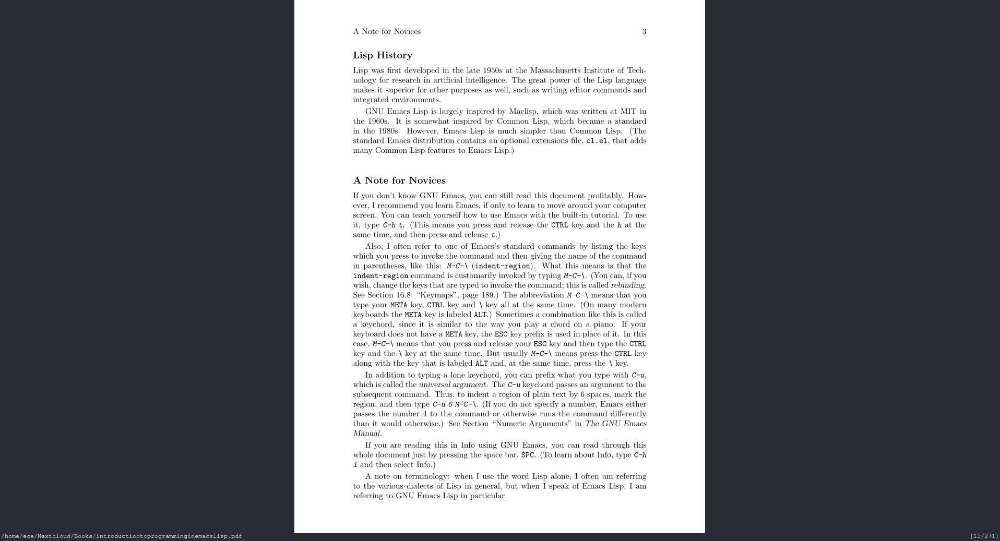

# Dracula for [zathura](https://pwmt.org/projects/zathura/)

> A dark theme for [Zathura](https://pwmt.org/projects/zathura/).

## Install

All instructions can be found at [draculatheme.com/zathura](https://draculatheme.com/zathura).

## Features

- \<C-r\> will switch between a light and dark background

## Team

This theme is maintained by the following person(s) and a bunch of [awesome contributors](https://github.com/dracula/zathura/graphs/contributors).

|  |
| ----------------------------------------------------------------------------------------------------------------- |
| [Ethan Edwards](https://github.com/ethancedwards8)                                                                |

## Community

- [Twitter](https://twitter.com/draculatheme) - Best for getting updates about themes and new stuff.
- [GitHub](https://github.com/dracula/dracula-theme/discussions) - Best for asking questions and discussing issues.
- [Discord](https://draculatheme.com/discord-invite) - Best for hanging out with the community.

## License

[MIT License](./LICENSE)
